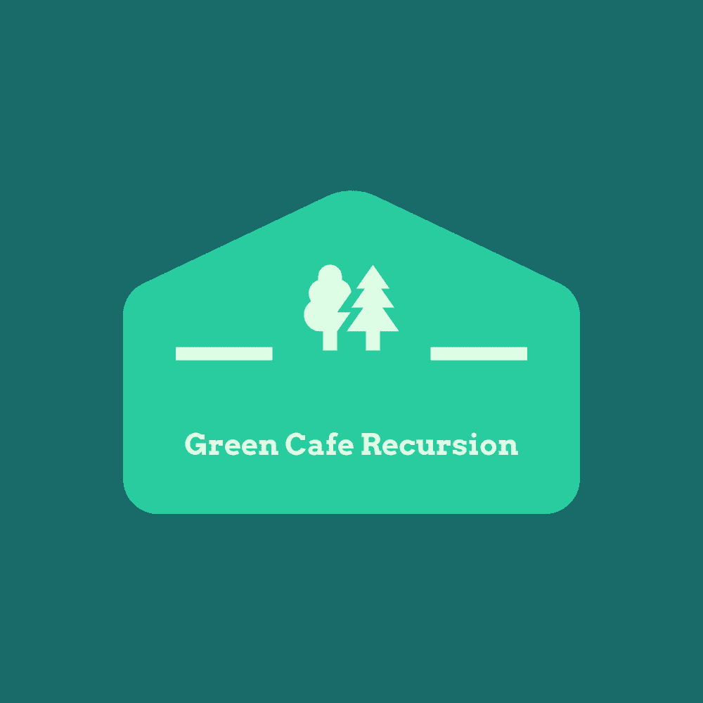

# Green Cafe Recursion 公式サイト

## コンセプト
GreenTeam運営によるカフェのwebサイト<br>

### ページ構成
- Homeページ
- Drinkページ
- Sweetsページ
- Foodページ
- Newsページ
- お問い合わせページ(フッターから「ご意見・お問い合わせ」クリック)
***
# 各ページ紹介
## Homeページ
### 1.Navbar(daiten)
各ページに遷移できるようにし、背景色に合わせるようにレイアウトしております。
今後の課題としてはserch欄で各ページの食べ物などを調べることができるようにしたいです。
### 2.スライダー(GypsyR)
javascriptで作成しました。(scripts/slider.js)<br>
画像、及び画像上に載せる文字、文字色をクラスで管理し追加を容易にし、開発の効率化を図りました。<br>
以下のようにインスタンスを作成すればスライダーに追加できます。 <br>（ただし枚数が変わった場合アニメーションについてstyle.cssで調整する必要があります。） <br>bootstrapのcarouselを用いたスライダーで改善予定です（現在carouselContents.js作成中)

```let sImg2 = new slideImg("slider_image2", "【特集】パンケーキセット！", "images/pancakes-5989136_1280.jpg","center", "c1","special.html#post-1");```

### 3.コンテナ(ミヤザキユー)
メニューページ紹介の上におすすめメニューを取り上げたカードを追加してみました。
ホバーするとcssアニメーションで動くようになっています。ボタンを押すと各ページに飛びます。

### 4.フッター(ミヤザキユー)
各SNSアイコンにホバーするとcssアニメーションで動くようになっています。

***
## Drink Page(ミヤザキユー)
おすすめのドリンクをランダムで選んでくれるドリンクおみくじ機能を搭載しました。
ページを更新しなければおみくじの内容が更新しない（クリックするたびに更新するわけではない）のが反省点です。<br>

***
## Sweet Page(daiten)
各ページの仕様に併せて作成。画像サイズはcssで調整
***
## Food page(daiten)
各ページの仕様に併せて作成。画像サイズはcssで調整
***
## News Page(GypsyR)
ニュースリリースに関するページ。メンバーの情報も記載。<br>（みなさんのGithub, Recursionのプロフィールへ飛べます）
***
## お問い合わせフォーム(ミヤザキユー)
Bootstrapを活用し、お問い合わせフォームを作成してみました。
（入力してもデータは受け取れませんが…）
***
## その他　参考ページなど
[マークダウン記法](https://qiita.com/kamorits/items/6f342da395ad57468ae3)<br>
[vscode:ブラウザでhtml開く](https://step-learn.com/article/vscode/016-open-browser.html)<br>
[「git pull」を実行するとリモートの内容が自動的にマージされてしまいますが、マージしたくない場合はfetchコマンド](https://qiita.com/tarr1124/items/d807887418671adbc46f)<br>
[issueを作成するとGitHubが自動的に番号を割り振ってくれますので、issueに関連した作業をしたときはコミットメッセージにそのissueの番号を含めるようにしてください。](https://github.com/recursion-teamdev/practice/issues/22)<br>
[githubでのスケジュール管理「Milestone」](https://seleck.cc/647)<br>
[pull requestとissue紐づけ](https://qiita.com/kodai_0122/items/18f7faa80f0302244c51)<br>
[gitで特定ファイルを特定のcommitに戻す](https://qiita.com/ritukiii/items/5bc8f74dbf4dc5d1384c)